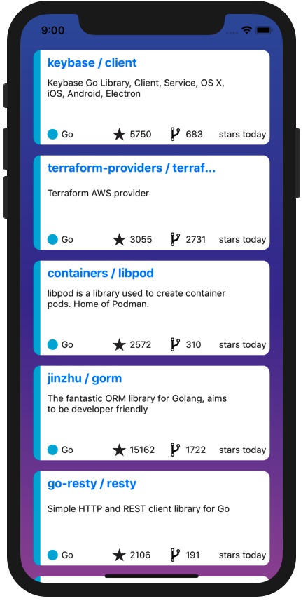
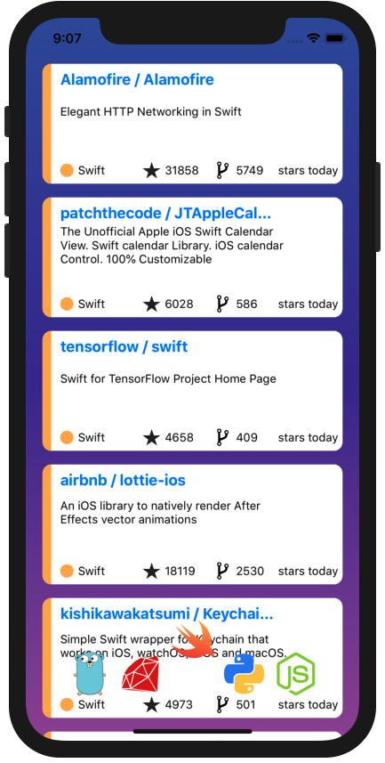
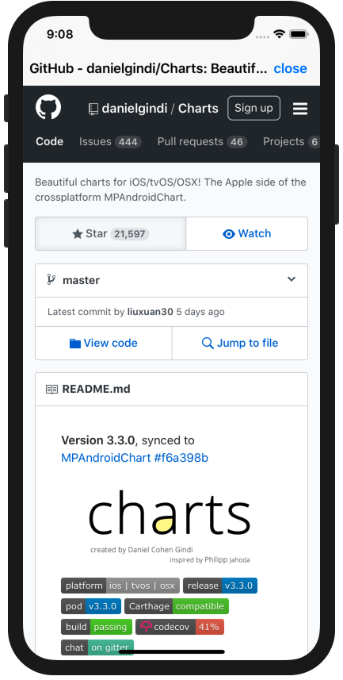
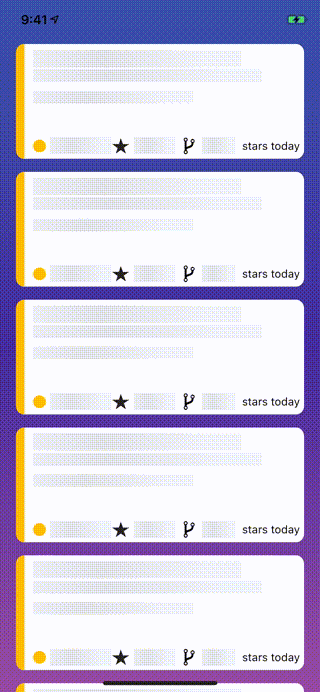

# GitHub Trend App

## Overview

  
  
  

## Usage
To Switch language, press the bottom and keep 0.5 sec.
Then, lang icons appears and you can select one.
When Trend Repository Cell is selected, you can browse repository in web-view.

## Using Libs
- [SwiftGen](https://github.com/SwiftGen/SwiftGen)
- [Moya](https://github.com/Moya/Moya)
- [RxSwift](https://github.com/ReactiveX/RxSwift)
- [SnapKit](https://github.com/SnapKit/SnapKit)
- [SkeletonView](https://github.com/Juanpe/SkeletonView)

## Customize
If you would like to change languages, modify `TrendPageViewController.swift` at https://github.com/arabian9ts/github-trend-app/blob/dev/OctCats/ViewControllers/TrendPageViewController.swift#L12 .
